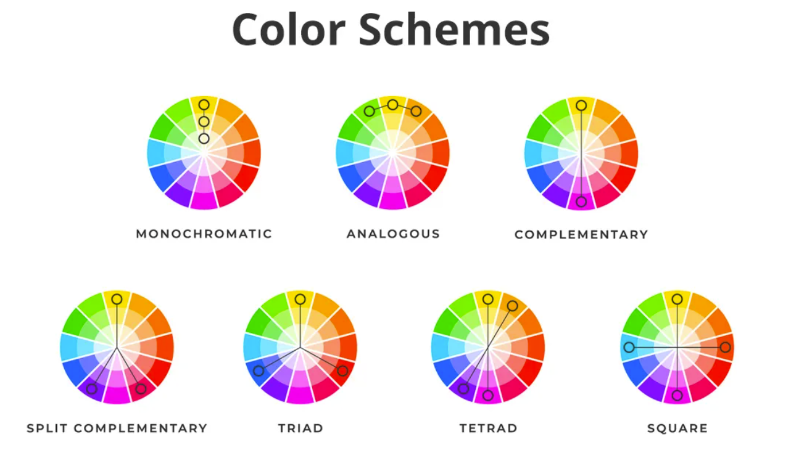

# Project-IDEAS
This repository is where i write down project ideas.


## Cosplay detector - **KNZY?**
(machine learning, computer vision, scrapping)

Cosplayers will try to look like their favorite characters as much as possible, but will never be 100% accurate. This is due to them being real people, their own appearences, quality of the cosplay, and other factors, sometimes people even genderbend characters(women cosplaying fictional men or men cosplaying fictional women), but the core elements of the fictional character will still be there.
The idea is to train a model on a long list of popular fictional characters, and use computer vision to accurately identify the core elements of a character from a cosplay, and tell what charater the cosplayer is cosplaying.

## LEGO Piece Detector - **KNZY?**
(Computer vision, Databases, Deep learning)

Program for detecting LEGO pieces and sets from an image, and uses the information to name the pieces and sets. Once the pieces or set is found, the informantion will be used, to make a list of other LEGO sets that can be made from the given pieces.
The list will be ordered by how many pieces missing to build the set, from smallest to biggest.

## Emulator - **KNZY?**
(operative systems, stuff i dont know about)


Some kind of game emulator, playstation 3, nintendo 3DS, gameboy or something else.

## Pokemon battle AI - **KNZY?**
(machine learning, scrapping)

Train a AI model from the bottom untill it is able to be effective in Pokemon battles. Pokemon showdown has complete logs of battles, which can be used for training.


## Hermitcrat Video Timeline
(Video and text processing, semantic similairty, YouTube API, neural models)

Hermitcraft is a popular minecraft server with 25 YouTubers, all creating content and storylines from within the server. Rewatching hermitcraft after a season is done, can be difficult, due to different upload schedules and video length of each creator. 

The idea is to map all the videoes of all hermitcraft members on the timeline, based on semantic similarity between sections of their videoes. Example: three content creators are all involved in the same storyline, and hold a minute meeting, the videoclip of the meeting will be in all three creators' videoes, so even though the video is in episode 5 for the first creator, episode 7 for the second, and episode 10 for the third, all videoes will be on the same place on the timeline. 


## Krita grayscale short
(C++, open-source, GUI, image processing)

In digital art, artists often wanna translate their image to grayscale to show the values of their artpiece. Krita does not have a shortcut for this. The idea here is simply to implement a shortcut that turns the image gray, with possible settings for different grayscales like, grayscale with onlu pure black and white, grayscale with 3 or 5 scales, and just normal grayscale.

## Program editing at runtime
Make a programming language(or editor?) where it is possible to edit the code at runtime. Example: the code below is currently running:
```
while(true){
  str a = "hey"
  print(a)
}

```
It simply keeps printing "hey", but if i edit the file, and change "hey" to "bye" and save. The running code will now start printing "bye", without having to recompile".


## 2D-raytracer 
Redo and improve my old 2d raytracer exam project from highscool.

## Colorscheme Editing - IN PROGRESS
(Image Processing, clustering, color-theory, (GUI))

A program that can read the color scheme of a image, in different formats, and allow the user to edit the color scheme by rotation it around the colorwheel, and maybe even allow to go from one color scheme to another, from monocromatic to analogous, from complimentary to split-complimentaary, etc.

<p align="center">
  
</p>

## Things To Implement
- Colorwheel GUI (QT?)
  - Translate RGB to HSV
  - Colorwheel coordinates
- Read & print colors from image onto colorwheel 
  - Research color fresh holds, when do we diffenriate between colors?
- Colorscheme detection
  - Detect clusters of colors on colorwheel
  - Make "pizza cut" for each cluster
  - Placement of pizza cuts, determines color scheme (two cluster oposite eachother is complimentary, etc.)
- Highlight colors from colorscheme
  - If blue-orange split-complimentary colorscheme, clicking on orange pizza cut, highlights all orange colors on image,
  clicking on blue pizza cut, highlights all blue colors.
- Rotate colorscheme around colorwheel
  - Image keeps colorscheme, but with different colors 
  - Grayscale value must stay the same
- Translation between similar colorschemes 
  - Monochronomatic to analogous (and reverse)
  - Complimentary to Split-complimentary to triad (and reverse)

